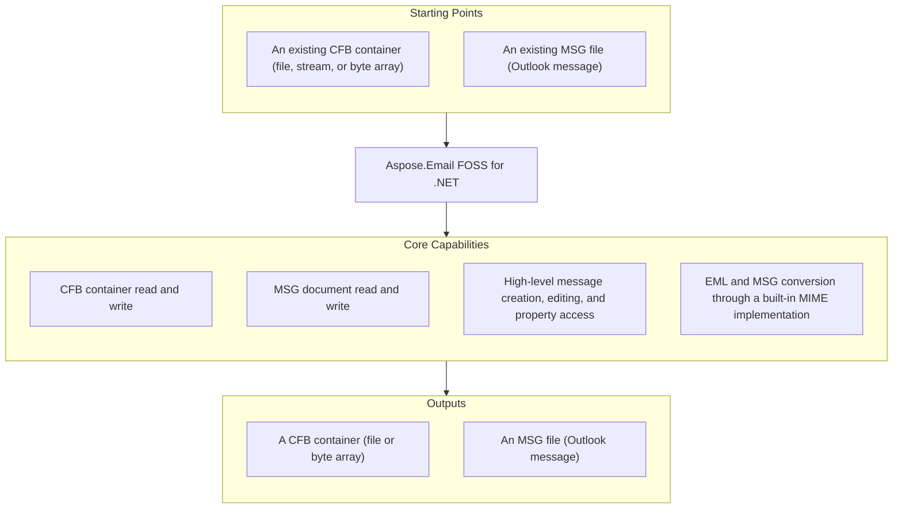

# Aspose.Email FOSS for .NET

[](LICENSE) [](https://www.nuget.org/packages/Aspose.Email.Foss/) [](https://github.com/aspose-email-foss/Aspose.Email-FOSS-for-.Net/graphs/contributors)

[](https://products.aspose.org/email/net/)

Aspose.Email FOSS for .NET is a free, open source email library for .NET — a C# toolkit for
deterministic binary and message processing: reading, creating, and inspecting Outlook `.msg`
files, Compound File Binary (CFB) containers, and EML message data. It ships with no required
third-party package dependencies and needs no Microsoft Outlook installation, making it a
lightweight fit for services, desktop tools, and command-line utilities that work with mailbox
data directly.

## Navigation

- [At a Glance](#at-a-glance)
- [Key Capabilities](#key-capabilities)
- [Installation](#installation)
- [Dependencies](#dependencies)
- [Quick Start](#quick-start)
- [Additional Examples](#additional-examples)
- [API Reference](#api-reference)
- [Documentation & Resources](#documentation--resources)
- [Scope and Limitations](#scope-and-limitations)
- [Development and Testing](#development-and-testing)
- [License](#license)

## At a Glance



## Key Capabilities

- **Open and traverse CFB containers** from a file, stream, or byte array via `CfbReader.FromFile()`, `CfbReader.FromStream()`, or `new CfbReader(data)`, then walk the directory tree with `IterStorages()`, `IterStreams()`, `IterChildren()`, and `IterTree()`.
- **Build CFB containers programmatically** with `CfbDocument`, `CfbStorage`, and `CfbStream`, and serialize them with `CfbWriter.ToBytes()` or `CfbWriter.WriteFile()`.
- **Read and write Outlook `.msg` files at the MAPI level** through `MsgReader`, `MsgWriter`, and `MsgDocument`, exposing property streams, recipient storages, and attachment sub-storages directly — useful for forensic inspection or repair of a `.msg` file's raw structure.
- **Create, edit, save, and reload complete, high-level mutable message objects** through `MapiMessage`: set `Subject`, `Body`, `HtmlBody`, `SenderName`, and `SenderEmailAddress`, then persist with `Save()` and reload with `FromFile()` or `FromStream()` — a free .NET API for building and processing email messages entirely in memory.
- **Set and read arbitrary MAPI properties** with `SetProperty()` and `GetPropertyValue()`, beyond the strongly-typed properties `MapiMessage` exposes directly.
- **Attach recipients and files** with `AddRecipient()` and `AddAttachment()`, including nested embedded messages via `AddEmbeddedMessageAttachment()`.
- **Convert between MSG and EML with no external MIME parser**: `MapiMessage.LoadFromEml()` parses a standard `.eml` file (RFC 5322 / MIME) directly into a `MapiMessage`, and `SaveToEml()` serializes one back to MIME — both implemented natively within the library.
- **Inspect parsing problems** on a loaded message or MSG document through the read-only `ValidationIssues` list, populated whenever strict parsing encounters a structural anomaly.

## Installation

The published NuGet package ID is `Aspose.Email.Foss` (confirmed against the library's own
`.csproj`, which is what NuGet actually built and published from):

```bash
dotnet add package Aspose.Email.Foss
```

Or add it directly to a project file:

```xml
<PackageReference Include="Aspose.Email.Foss" Version="26.7.0" />
```

The library targets .NET 8.0 or later and runs on Windows, Linux, macOS, Docker containers, and
serverless functions — see [Dependencies](#dependencies) below for the full required, native, and
development-only breakdown.

## Dependencies

### Required Package Dependencies

No required third-party package dependencies. The published `Aspose.Email.Foss` package builds
from `src/Aspose.Email.Foss/Aspose.Email.Foss.csproj`, which declares zero `<PackageReference>`
entries — CFB, MSG, and EML/MIME handling are all implemented natively within the library.

### Native and System Requirements

- Requires the .NET 8.0 SDK (or later) to build, and the matching .NET 8.0 runtime (or later) to run.

### Development Dependencies

- `Microsoft.NET.Test.Sdk` 17.8.0, `xunit` 2.5.3, and `xunit.runner.visualstudio` 2.5.3 — the xUnit test host and adapter used only by the test project.
- `coverlet.collector` 6.0.0 — code-coverage collection for the test suite.

None of these are referenced by the main library project; they apply only to
`tests/Aspose.Email.Foss.Tests/Aspose.Email.Foss.Tests.csproj` and are never shipped with the
published package.

## Quick Start

Read a subject from an MSG file:

```csharp
using System.IO;
using Aspose.Email.Foss.Msg;

using var stream = File.OpenRead("sample.msg");
var message = MapiMessage.FromStream(stream);
Console.WriteLine(message.Subject);
```

## Additional Examples

A few more real, runnable patterns beyond the Quick Start example above.

### Create and Save an MSG Message

```csharp
using System.IO;
using Aspose.Email.Foss.Msg;

var message = MapiMessage.Create("Hello", "Body");
message.SenderName = "Alice";
message.SenderEmailAddress = "alice@example.com";
message.AddRecipient("bob@example.com", "Bob");
using var attachmentStream = new MemoryStream("abc"u8.ToArray());
message.AddAttachment("note.txt", attachmentStream, "text/plain");
using var output = File.Create("hello.msg");
message.Save(output);
```

<details>
<summary>View Additional Examples</summary>

### Convert EML to MSG

```csharp
using System.IO;
using Aspose.Email.Foss.Msg;

using var input = File.OpenRead("message.eml");
var message = MapiMessage.LoadFromEml(input);
using var msgOutput = File.Create("message.msg");
message.Save(msgOutput);
using var emlOutput = File.Create("roundtrip.eml");
message.SaveToEml(emlOutput);
```

### Inspect a CFB Container's Structure

`CfbReader` gives direct access to a `.msg` file's underlying CFB geometry — useful when
diagnosing a damaged or non-standard file, independently of the higher-level MSG or MapiMessage
APIs.

```csharp
using Aspose.Email.Foss.Cfb;

using var cfb = CfbReader.FromFile("sample.msg");
Console.WriteLine($"Sector size: {cfb.SectorSize}");
Console.WriteLine($"Directory entries: {cfb.DirectoryEntryCount}");

foreach (var (depth, entry) in cfb.IterTree())
{
    Console.WriteLine(new string(' ', depth * 2) + entry.Name);
}
```

</details>

## API Reference

`MapiMessage` is the primary high-level entry point for creating, editing, and converting
messages; `CfbReader`/`CfbWriter` and `MsgReader`/`MsgWriter`/`MsgDocument` provide direct,
lower-level access to the `Aspose.Email.Foss.Cfb` and `Aspose.Email.Foss.Msg` namespaces the
high-level API is built on. The public surface spans 29 classes and enumerations in a single
module, summarized below.

<details>
<summary>View the Supported Public API Surface</summary>

### Aspose.Email.Foss

| Class | Description |
|---|---|
| `CfbConstants` | CfbConstants.ByteOrderLittleEndian identifies little-endian integer encoding in CFB files. |
| `CfbDocument` | CfbDocument can be instantiated directly, or created from existing data using CfbDocument.FromFile(path), FromStream(stream), or FromReader(reader). |
| `CfbException` | CfbException.CfbException creates an exception instance containing the provided error message. |
| `CfbNode` | CfbNode provides metadata for each entry in a CFB container, including Name, Clsid, CreationTime, and ModifiedTime. |
| `CfbReader` | CfbReader.FromFile(path) opens a CFB file and provides access to its header, FAT, MiniFAT, and directory entries via properties such as MajorVersion and SectorSize. |
| `CfbStorage` | CfbStorage.CfbStorage initializes a new storage node with the specified name. |
| `CfbStream` | CfbStream.CfbStream creates a new CfbStream with the specified name and optional byte array data. |
| `CfbWriter` | CfbWriter.WriteFile(document, path) serializes a CfbDocument to a file, while ToBytes(document) returns the binary representation as a byte array. |
| `DirectoryEntry` | DirectoryEntry methods IsStorage(), IsStream(), and IsRoot() let developers determine the type of a directory entry when traversing a CFB structure. |
| `DirectoryEntryNameComparer` | DirectoryEntryNameComparer.Compare compares two name strings and returns an int indicating sort order. |
| `Header` | Header.SectorSize represents the size of a regular sector in bytes. |
| `MapiAttachment` | MapiAttachment.FromBytes(filename, data, mimeType, contentId) creates an attachment object that can be added to a message; its properties Filename, MimeType, and Data expose the attachment metadata and content. |
| `MapiMessage` | MapiMessage.Create(subject, body, unicodeStrings) constructs a new mutable message with the given subject and body. |
| `MapiProperty` | MapiProperty.MapiProperty constructs a property with given id, type, value, and flags. |
| `MapiPropertyCollection` | MapiPropertyCollection.Set(property:MapiProperty) adds or updates the specified MapiProperty in the collection. |
| `MapiRecipient` | MapiRecipient.DisplayName gets or sets the recipient's display name. |
| `MsgConstants` | MsgConstants.PropertyStreamName provides the standard name of the top‑level property stream used in MSG files. |
| `MsgDocument` | MsgDocument.FromFile(path, strict) loads an MSG file into a MsgDocument object for inspection or modification. |
| `MsgException` | MsgException.MsgException creates a new exception with the given message. |
| `MsgReader` | MsgReader.FromFile(path, strict) creates a MsgReader that reads an Outlook MSG file from the specified file path. |
| `MsgStorage` | MsgStorage.AddStream(stream) adds a MsgStream to the storage, allowing custom binary data to be embedded in the MSG file. |
| `MsgStream` | MsgStream.MsgStream initializes a new stream with a name and optional data bytes. |
| `MsgWriter` | MsgWriter.WriteFile(document, path) writes a MsgDocument to the given file path in MSG format. |

#### Enumerations

| Enumeration | Description |
|---|---|
| `CommonMessagePropertyId` | Common MAPI property identifiers used by the MSG reader and writer for core message semantics, body fields, transport headers, and attachments. |
| `DirectoryColorFlag` | Stores the red-black tree color used by directory sibling links. |
| `DirectoryObjectType` | Classifies the directory entry payload as unallocated, storage, stream, or root storage. |
| `MsgStorageRole` | MsgStorageRole.Generic represents a generic storage role not specific to other categories. |
| `PropertyTypeCode` | MAPI property type codes that appear in property tags and stream names in MSG files. |
| `SectorMarker` | Special FAT marker values reserved for sector allocation metadata. |

---

#### Detailed Member Reference

### CFB Container Access

- `CfbReader` (implements `IDisposable`)
  - `FromFile(path)`, `FromStream(stream)`, `CfbReader(data)`
  - `IterStorages()`, `IterStreams()`, `IterChildren(storageStreamId)`, `IterTree(startStreamId = 0)`, `FindChildByName(storageStreamId, name)`, `ResolvePath(names, startStreamId)`
  - `GetEntry(streamId)`, `GetStreamData(streamId)`
  - Properties: `Header`, `Difat`, `Fat`, `MiniFat`, `DirectoryEntries`, `RootEntry`, `MajorVersion`, `SectorSize`, `MiniSectorSize`, `DirectoryEntryCount`, `FileSize`
- `CfbWriter` (static)
  - `ToBytes(document)`, `WriteFile(document, path)`
- `CfbDocument` / `CfbStorage` / `CfbStream`
  - Build a document in memory with `CfbStorage.AddStorage()`/`AddStream()`, then hand the root `CfbDocument` to `CfbWriter`.

### MSG Document Access

- `MsgReader` (implements `IDisposable`)
  - `FromFile(path, strict)`, `FromStream(stream, strict)`
  - `ValidationIssues: IReadOnlyList<string>`
- `MsgWriter` (static)
  - `ToBytes(document)`, `WriteFile(document, path)`
- `MsgDocument`
  - `FromFile(path, strict)`, `FromStream(stream, strict)`, `ToCfbDocument()`
  - `Root: MsgStorage`
- `MsgStorage`
  - `AddStream(stream)`, `AddStorage(storage)`, `FindStream(name)`, `FindStorage(name)`
  - Properties: `Role: MsgStorageRole`, `Streams: IList<MsgStream>`, `Storages: IList<MsgStorage>`

### High-Level Message API

- `MapiMessage` (implements `IDisposable`)
  - `Create(subject, body, unicodeStrings)`, `FromFile(path, strict)`, `FromStream(stream, strict)`, `FromMsgDocument(document)`
  - `LoadFromEml(path)` / `LoadFromEml(stream)` / `LoadFromEml(data)`
  - `Save()`, `Save(path)`, `Save(stream)`
  - `SaveToEml()`, `SaveToEml(path)`, `SaveToEml(stream)`
  - `AddRecipient(emailAddress, displayName, recipientType)`, `AddAttachment(filename, data, mimeType, contentId)`, `AddAttachment(filename, stream, mimeType, contentId)`, `AddEmbeddedMessageAttachment(message, filename, mimeType)`
  - `SetProperty(propertyId, propertyType, value, flags)`, `GetPropertyValue(propertyId, propertyType, decode)`, `IterProperties()`, `IterPropertyKeys()`
  - Properties: `Subject`, `Body`, `HtmlBody`, `SenderName`, `SenderEmailAddress`, `MessageClass`, `InternetMessageId`, `MessageDeliveryTime`, `Recipients`, `Attachments`, `ValidationIssues`
- `MapiAttachment`
  - `FromBytes(filename, data, mimeType, contentId)`, `FromStream(filename, stream, mimeType, contentId)`, `OpenRead()`
  - Properties: `Filename`, `Data`, `MimeType`, `ContentId`, `IsEmbeddedMessage`, `EmbeddedMessage: MapiMessage?`
- `MapiPropertyCollection`
  - `Set(property)`, `Add(propertyId, propertyType, value, flags)`, `Get(propertyId, propertyType)`, `Remove(propertyId, propertyType)`, `IterProperties()`

</details>

## Documentation & Resources

- **[Getting started guide](https://docs.aspose.org/email/net/)** — installation, walkthroughs, and feature guides for this library.
- **[How-to guides & FAQ](https://kb.aspose.org/email/net/)** — task-focused answers for common MSG, CFB, and EML questions.
- **[Full API reference](https://reference.aspose.org/email/net/)** — the complete, browsable reference for all 29 public types (the [API reference](#api-reference) section above covers the essentials).
- **[Public API summary](PUBLIC_API.md)** — the repository's own stable-namespace and primary-type list.
- **[Changelog](CHANGELOG.md)** — release history.
- Found a bug or have a feature request? [Open an issue](https://github.com/aspose-email-foss/Aspose.Email-FOSS-for-.Net/issues) on GitHub.

## Scope and Limitations

- **No IMAP, SMTP, or POP3 support** — this library reads and writes local files only; it does not connect to mail servers.
- **No TNEF support** — Transport Neutral Encapsulation Format (`winmail.dat`) is not parsed or generated.
- **No calendar or appointment support** — calendar-specific MAPI properties can be accessed generically via `SetProperty()`/`GetPropertyValue()`, but there is no dedicated calendar API.
- **No .NET Framework support** — requires .NET 8.0 or later; classic .NET Framework (4.x) is not supported.

These limitations don't apply to
[Aspose.Email for .NET — Enterprise Edition](https://products.aspose.com/email/net/), which adds
broader format and protocol coverage: direct IMAP/SMTP/POP3 mail-server connectivity, TNEF
(`winmail.dat`) support, calendar and appointment APIs, and classic .NET Framework support
alongside this edition's MSG, CFB, and EML processing.

## Development and Testing

Clone the repository and run the xUnit test suite:

```bash
git clone https://github.com/aspose-email-foss/Aspose.Email-FOSS-for-.Net.git
cd Aspose.Email-FOSS-for-.Net
dotnet build src/Aspose.Email.Foss/Aspose.Email.Foss.csproj -c Release
dotnet test tests/Aspose.Email.Foss.Tests/Aspose.Email.Foss.Tests.csproj
```

The test project covers CFB round-trips, MSG reading, and EML round-trip conversion
(`CfbRoundTripTests`, `MsgReaderTests`, `MapiMessageTests`, `MapiMessageEmlTests`,
`MetadataSmokeTests`). Three runnable example programs — `create_msg_and_eml.cs`, `msg_reader.cs`,
and `msg_summary.cs` — live under [`examples/`](examples/), each with its own project file and
listed in [examples/README.md](examples/README.md); run one directly, for example:

```bash
dotnet run --project examples/create_msg_and_eml/create_msg_and_eml.csproj
```

## License

This project is licensed under the [MIT License](LICENSE). The MIT License permits use, copying,
modification, distribution, sublicensing, and commercial use, provided its copyright and
permission notice are retained. The software is provided without warranty.

CLA signing notification test
